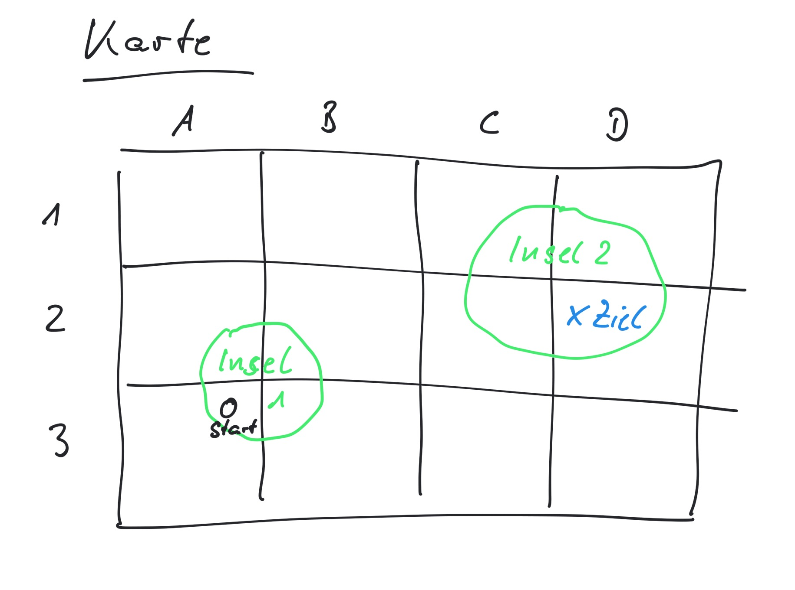

Adventure
==========

Was brauchen wir im Adventure?

* eine Karte in der wir uns bewegen -> die Karte ist als Raster aus einzelnen Szenen angeordnet



* Szenen mit Name, Beschreibung und Richtungen in die man sich bewegen kann - später auch in Abhängigkeit von Objekten die man gesammelt hat
* Gegenstände die man nehmen oder verändern kann
* Aufgaben
* Handlung

### Szene
```
+-------+-------+-------+-------+
| Meer1 | Meer2 | I2 NW | I2 NO |
+-------+-------+-------+-------+
| I1 NW | I1 NO | I2 SW | I2 SO |
+-------+-------+-------+-------+
| I1 SW | I1 SO | Meer3 | Meer4 |
+-------+-------+-------+-------+
```

-> Objekt
-> Matrix

### Gegenstand

-> Objekt

### Aufgabe

-> Funktion

### Handlung

-> Graph
